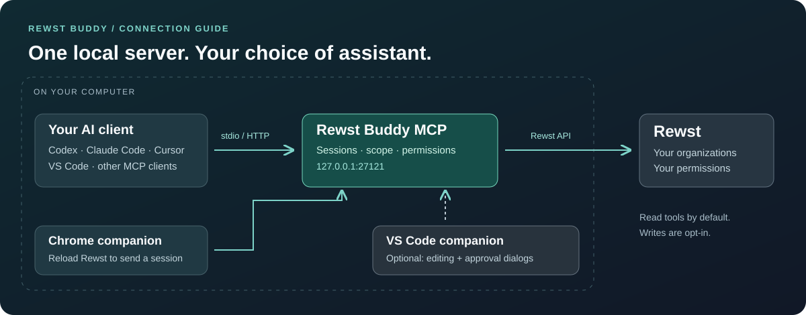
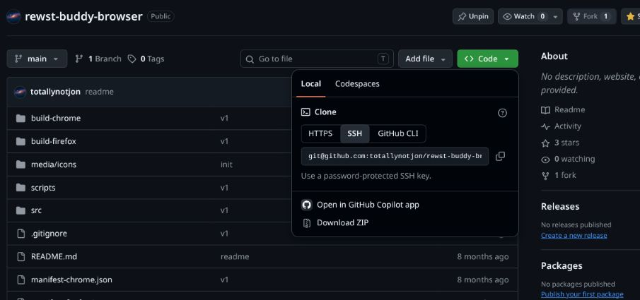
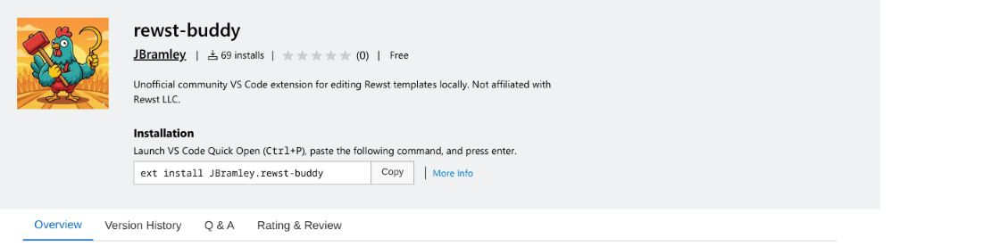

# Rewst Buddy

**Your Rewst workflows. Your AI assistant. One local MCP server.**

Find workflows, investigate failed runs, read templates, and make approved changes from **Codex, Claude Code, Cursor, VS Code, or another MCP client**. Rewst Buddy uses your existing Rewst session and permissions.

**[Get connected →](docs/mcp-setup.md)** · **[Chrome walkthrough](docs/browser-extension.md)** · **[Things to try](docs/using-mcp.md)** · **[All docs](docs/README.md)**



_Connection diagram, not an application screenshot. VS Code is optional; the MCP server works on its own._

## From setup to your first answer

### 1 · Connect your assistant

Install **Node.js 22+**, then let your MCP client launch:

```sh
npx --yes rewst-buddy-mcp@0.1.0
```

For example, with **Codex**:

```sh
codex mcp add rewst-buddy -- npx --yes rewst-buddy-mcp@0.1.0
```

| Your client                        | Copy the setup                                                           |
| ---------------------------------- | ------------------------------------------------------------------------ |
| Codex                              | [CLI command and TOML](docs/mcp-setup.md#codex)                          |
| Claude Code                        | [User-wide CLI setup](docs/mcp-setup.md#claude-code)                     |
| Cursor                             | [Global or project JSON](docs/mcp-setup.md#cursor)                       |
| VS Code / GitHub Copilot           | [Workspace MCP configuration](docs/mcp-setup.md#vs-code--github-copilot) |
| Another client                     | [Stdio launch settings](docs/mcp-setup.md#other-local-mcp-clients)       |
| Several clients sharing one server | [Persistent local HTTP](docs/mcp-setup.md#persistent-http-server)        |

With stdio, your client starts the server for you. Examples pin the published `0.1.0` release; use `@latest` if you prefer to follow releases.

### 2 · Bring your Rewst session

Download the [Chrome companion](https://github.com/totallynotjon/rewst-buddy-browser), extract the ZIP, and load its **`build-chrome/`** folder from `chrome://extensions` with Developer mode enabled. Start the MCP server, then reload a signed-in Rewst organization page.



_Choose **Code → Download ZIP**, then extract it. [Continue the illustrated browser setup →](docs/browser-extension.md)_

Chrome transfers the session to the server on **127.0.0.1:27121**. This works with VS Code closed. For headless use or saved logins, see [session and credential options](docs/mcp-setup.md#supply-a-session-without-the-browser-extension).

### 3 · Ask something useful

> Use Rewst Buddy to list my organizations and show the current working scope.

Then try:

| You want to…             | Ask your assistant…                                                                       |
| ------------------------ | ----------------------------------------------------------------------------------------- |
| Understand an automation | “Find the onboarding workflow in Acme and explain its tasks and branches.”                |
| Investigate a failed run | “Find the latest failed execution of this workflow and inspect the failed task's output.” |
| Find reusable code       | “Find notification templates in Acme and show their contents.”                            |
| Explore the API          | “Inspect the GraphQL schema and build a read-only query for this data.”                   |

_Acme is an example organization. Use your own organization and workflow names._

**[Follow a complete investigation →](docs/using-mcp.md)**

## Start with reads. Enable changes when you need them

Read tools are available by default. Typed writes require an organization scope and an explicit write policy. To run with standing approval for typed writes in one organization:

```sh
npx --yes rewst-buddy-mcp@0.1.0 --org YOUR_ORG_ID --allow-writes --approve-writes
```

Stop the existing owner before changing its startup policy. For client-managed stdio, append the flags to its launch arguments. **Raw GraphQL mutations still require an attached VS Code window to approve each call.**

[Write permissions and scope →](docs/mcp-setup.md#enabling-writes)

## Add VS Code when you want to edit locally

The [VS Code companion](https://marketplace.visualstudio.com/items?itemName=JBramley.rewst-buddy) adds linked template files, sync-on-save with conflict detection, Jinja completion and preview, and approval dialogs. The browser's template-opening action opens a template in an attached editor.



_Optional editor companion. [Set it up →](docs/quickstart.md)_

The first compatible process owns sessions, storage, and policy. Other clients reuse it. Start a persistent server first if you want sessions to remain available after closing an assistant or editor.

## Pick your next step

| Guide                                                    | What it covers                                                                      |
| -------------------------------------------------------- | ----------------------------------------------------------------------------------- |
| [MCP setup](docs/mcp-setup.md)                           | Client configs, login, regions, HTTP, Windows, WSL, containers, and troubleshooting |
| [Chrome walkthrough](docs/browser-extension.md)          | Download, load the correct folder, transfer a session, and verify the connection    |
| [Using Rewst Buddy](docs/using-mcp.md)                   | Example prompts, investigation workflow, scope, and write approvals                 |
| [VS Code quick start](docs/quickstart.md)                | Link one template or an entire folder; edit and sync                                |
| [Server reference](packages/mcp-server/README.md)        | CLI, credential storage, policy details, and embedding                              |
| [Build from source](docs/mcp-setup.md#build-from-source) | Use a local build in your MCP client                                                |

Rewst Buddy is an **unofficial community project**, unaffiliated with or supported by Rewst LLC. MIT licensed. Rewst data returned through MCP is also subject to your AI client's data-handling policy.

[Report an issue](https://github.com/totallynotjon/rewst-buddy/issues) · [Browser extension source](https://github.com/totallynotjon/rewst-buddy-browser)
