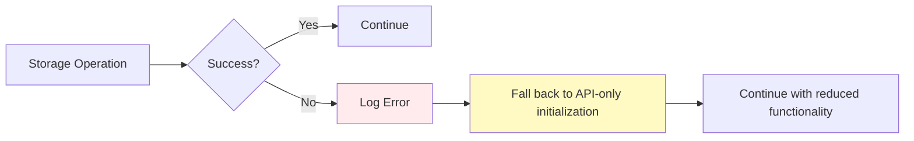

# TemplateFolder Storage Integration Plan

## Current State Analysis

### Issues Identified:
1. **Storage Key Mismatch**: SaveFolderStructure saves `templateFolderStructure` but TemplateFolder reads `folderStructure`
2. **Incomplete Implementation**: Only handles top-level org folders, not recursive structures
3. **No Entry Movement**: Creates missing folders but doesn't move existing templates to proper locations
4. **Missing Tree Integration**: Doesn't use Tree.ts methods for proper entry management

## Detailed Implementation Plan

### 1. Fix Storage Data Structure

**Current Problem**: Mismatch between saved and read keys
```typescript
// SaveFolderStructure saves:
orgData.templateFolderStructure = serializedStructure;

// TemplateFolder reads:
orgData.folderStructure // <- Wrong key!
```

**Solution**: Standardize on `templateFolderStructure`

### 2. Enhanced Folder Structure Format

```typescript
interface StoredOrgData {
  templateFolderStructure?: {
    folders: SerializableTemplateFolder[];
    templatePlacements: {
      templateId: string;
      folderId: string; // Where the template should be placed
    }[];
  };
  lastUpdated: string;
}
```

### 3. Complete TemplateFolder.initialize() Overhaul

```mermaid
graph TD
    A[Start initialize()] --> B{Already initialized?}
    B -- Yes --> Z[Return early]
    B -- No --> C[Check if top-level org folder]
    C -- Yes --> D[Load stored structure]
    C -- No --> E[Standard folder initialization]
    
    D --> F[Parse stored data]
    F --> G[Create missing child folders recursively]
    G --> H[Load templates from API]
    H --> I[Move templates to stored locations]
    I --> J[Validate structure integrity]
    J --> K[Mark as initialized]
    
    E --> L[Initialize as regular folder]
    L --> K
    K --> Z[Complete]
    
    style D fill:#e1f5fe
    style G fill:#f3e5f5
    style I fill:#fff3e0
```

### 4. Implementation Steps

#### Step 1: Update Storage Data Format
```typescript
// In SaveFolderStructure.ts - Update to save comprehensive structure
const orgStructure = {
  folders: await this.collectAllFolders(org),
  templatePlacements: await this.collectTemplatePlacements(org)
};

const orgData = {
  ...JSON.parse(this.cmdContext.storage.getRewstOrgData(orgId)),
  templateFolderStructure: orgStructure,
  lastUpdated: new Date().toISOString()
};
```

#### Step 2: Recursive Folder Creation
```typescript
// In TemplateFolder.ts
private async createFoldersFromStoredStructure(
  storedFolders: SerializableTemplateFolder[],
  parentId: string
): Promise<void> {
  const childFolders = storedFolders.filter(f => f.parentId === parentId);
  
  for (const folderData of childFolders) {
    let existingFolder = this.children.find(
      child => child instanceof TemplateFolder && child.id === folderData.id
    ) as TemplateFolder;
    
    if (!existingFolder) {
      // Create missing folder using Tree integration
      const folderInput: EntryInput = {
        client: this.client,
        id: folderData.id,
        label: folderData.label,
        parent: this,
      };
      existingFolder = new TemplateFolder(folderInput);
    }
    
    // Recursively create children
    await existingFolder.createFoldersFromStoredStructure(storedFolders, folderData.id);
  }
}
```

#### Step 3: Template Movement Integration
```typescript
// In TemplateFolder.ts
private async moveTemplatesToStoredLocations(
  templatePlacements: Array<{templateId: string, folderId: string}>,
  allFolders: Map<string, TemplateFolder>
): Promise<void> {
  for (const placement of templatePlacements) {
    const template = await this.findTemplateById(placement.templateId);
    const targetFolder = allFolders.get(placement.folderId);
    
    if (template && targetFolder && template.parent !== targetFolder) {
      log.info(`Moving template "${template.label}" from "${template.parent?.label}" to "${targetFolder.label}"`);
      
      // Use Entry.setParent() for proper tree management
      template.setParent(targetFolder);
    }
  }
}
```

#### Step 4: Tree Integration Methods
```typescript
// Helper methods for Tree integration
private async findTemplateById(templateId: string): Promise<Template | undefined> {
  const allTemplates = await this.getAllEntriesOfType(RType.Template, Template);
  return allTemplates.get(templateId);
}

private async getAllFoldersRecursively(): Promise<Map<string, TemplateFolder>> {
  return await this.getAllEntriesOfType(RType.TemplateFolder, TemplateFolder);
}
```

### 5. Error Handling Strategy



### 6. Testing Strategy

#### Immediate Verification
```typescript
// Add to initialize() method
private async verifyStoredStructure(): Promise<void> {
  try {
    const storedData = storage.getRewstOrgData(this.parent!.id);
    const parsedData = JSON.parse(storedData);
    
    if (parsedData.templateFolderStructure) {
      log.info(`✓ Stored structure found with ${parsedData.templateFolderStructure.folders?.length || 0} folders`);
      log.info(`✓ Template placements: ${parsedData.templateFolderStructure.templatePlacements?.length || 0}`);
    } else {
      log.info(`ℹ No stored structure found for org ${this.parent!.id}`);
    }
  } catch (error) {
    log.error(`✗ Stored structure verification failed: ${error}`);
  }
}
```

### 7. Performance Considerations

- **Lazy Loading**: Only process stored structure for top-level folders
- **Batch Operations**: Group template movements to minimize tree updates
- **Caching**: Cache folder lookups during initialization
- **Error Recovery**: Graceful fallback to API-only mode if storage fails

### 8. Integration Points

#### With SaveFolderStructure Command
- Ensure consistent data format
- Add validation of saved structure
- Include template placement information

#### With Tree.ts
- Use `lookupEntry()` for finding existing entries
- Use `insertEntry()` for creating new folders
- Use Entry `setParent()` for moving templates

#### With Storage.ts
- Leverage global storage singleton
- Use proper error handling with `ensureInitialized()`
- Consider storage performance for large folder structures

## Implementation Priority

1. **High Priority**: Fix storage key mismatch and basic folder creation
2. **Medium Priority**: Implement template movement logic
3. **Low Priority**: Add comprehensive validation and performance optimizations

## Success Criteria

✅ **Folder Structure Restoration**: Missing folders are created from stored state  
✅ **Template Positioning**: Templates are moved to their stored locations  
✅ **Tree Integrity**: All operations use proper Tree.ts methods  
✅ **Error Resilience**: Graceful fallback when storage fails  
✅ **Performance**: No significant impact on initialization time  

## Files to Modify

1. **src/fs/models/TemplateFolder.ts** - Main implementation
2. **src/commands/view-commands/SaveFolderStructure.ts** - Update data format
3. **src/storage/Storage.ts** - Add validation methods (if needed)

## Testing Plan

1. **Unit Tests**: Test folder creation and template movement logic
2. **Integration Tests**: Test with real stored data
3. **Edge Cases**: Test with corrupted/missing storage data
4. **Performance Tests**: Measure initialization time with large structures